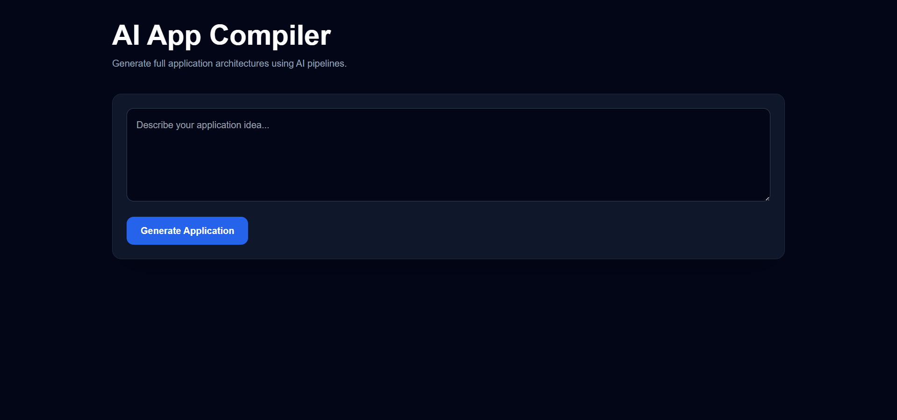
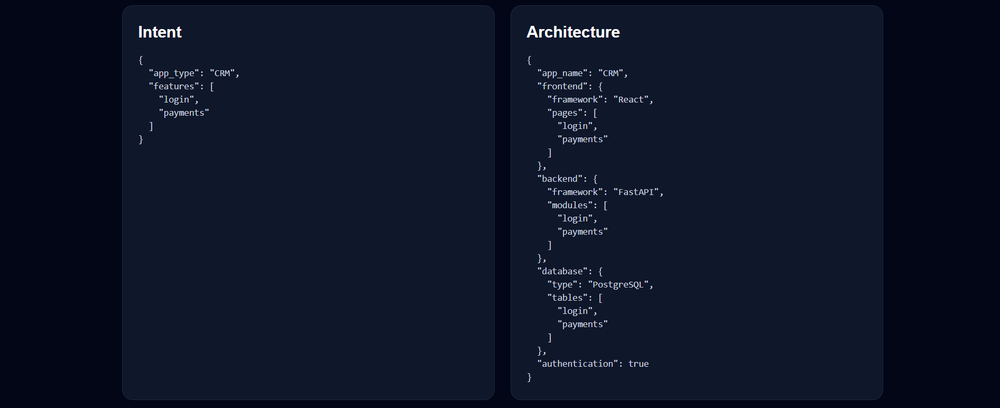
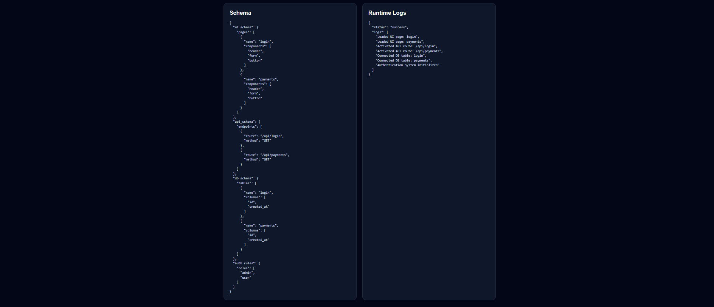
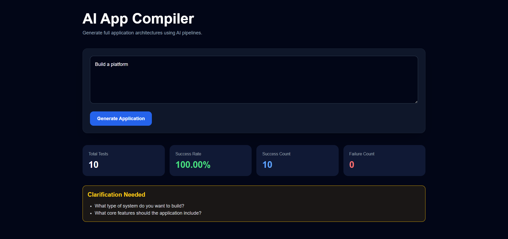

# AI App Compiler 🚀


AI App Compiler is an AI-powered full-stack application architecture generation platform that transforms natural language prompts into structured software blueprints using modular AI pipelines.

The system automatically generates:

- Application intent
- Frontend architecture
- Backend architecture
- Database schema
- API schema
- Runtime simulations
- Validation reports
- Starter frontend/backend code

Designed as an AI systems engineering project, the platform focuses on reliability, modularity, validation, and autonomous pipeline orchestration.

---

# Key Features

## AI Intent Extraction

Uses LLM-powered parsing to convert user prompts into structured application intent.

### Example

```txt
Build a CRM with login, payments, and analytics dashboard
```

---

## Automated Architecture Design

Generates:

- Frontend structure
- Backend modules
- Database models
- Authentication systems

---

## Schema Generation Engine

Automatically creates:

- UI schemas
- API endpoint schemas
- Database schemas

---

## Ambiguity Detection System

Detects vague or incomplete prompts and requests clarification before continuing the pipeline.

### Example

```txt
Build a platform
```

---

## Retry Intelligence

Implements retry-based recovery mechanisms for unstable AI pipeline stages to improve robustness.

---

## Evaluation Framework

Benchmarks prompts and measures:

- Success rate
- Failure rate
- Runtime stability
- Pipeline robustness

---

## Runtime Simulation

Simulates runtime initialization and service activation logs for generated applications.

---

## AI Code Generation

Generates starter:

- React frontend components
- FastAPI backend routes

---

## Downloadable Reports

Exports generated architectures and pipeline outputs as downloadable JSON reports.

---

# System Pipeline Architecture

```txt
User Prompt
    ↓
Intent Extraction
    ↓
Architecture Generator
    ↓
Schema Generator
    ↓
Validation Engine
    ↓
Repair Engine
    ↓
Consistency Checker
    ↓
Runtime Simulator
    ↓
Code Generator
```

---

# Tech Stack

## Frontend

- React
- Tailwind CSS
- Vite

## Backend

- FastAPI
- Python

## AI Infrastructure

- Groq API
- Llama 3.1

---

# Screenshots

## Dashboard



---

## Generated Architecture



---

## Runtime Simulation



---

## Ambiguity Detection



---

# Local Setup

## Backend

```bash
cd backend

python -m venv venv

venv\Scripts\activate

pip install -r requirements.txt

uvicorn main:app --host 127.0.0.1 --port 9001
```

---

## Frontend

```bash
cd frontend

npm install

npm run dev
```

---

# Evaluation Framework

Run benchmark evaluations using:

```bash
python evaluation/run_evaluation.py
```

The framework generates:

- Success metrics
- Failure statistics
- Runtime latency measurements

---

# Project Structure

```txt
ai-app-compiler/
│
├── backend/
│   ├── pipeline/
│   ├── evaluation/
│   ├── main.py
│   ├── requirements.txt
│   └── .env
│
├── frontend/
│   ├── src/
│   ├── public/
│   ├── package.json
│   └── vite.config.js
│
├── screenshots/
│   ├── dashboard.png
│   ├── architecture.png
│   ├── runtime.png
│   └── ambiguity.png
│
├── README.md
│
└── .gitignore
```

---

# Future Improvements

- Production-grade code generation
- Multi-agent orchestration
- Vector database integration
- Retrieval-Augmented Generation (RAG)
- Docker containerization
- Kubernetes deployment
- Persistent AI memory systems

---

# Author

## Rama Narithalli Reddi

B.Tech Student | AI & Machine Learning Enthusiast

GitHub: https://github.com/Reddi-Rama

LinkedIn: https://www.linkedin.com/in/rama-it/

---

If you found this project useful or interesting, consider giving it a star ⭐